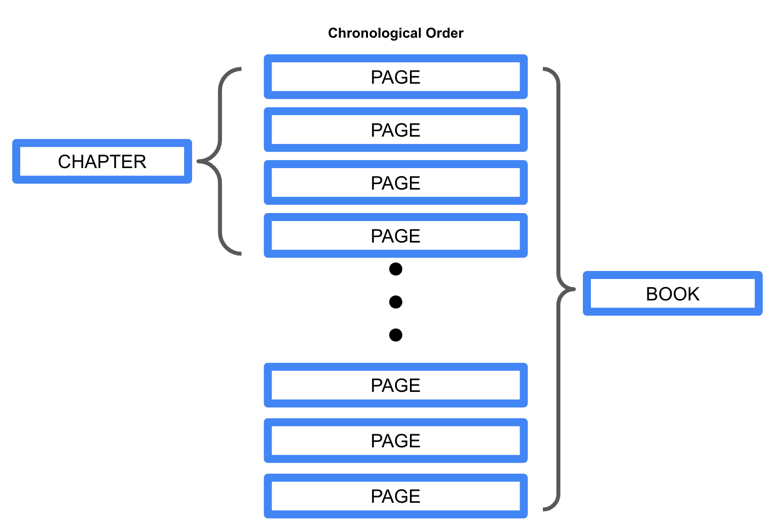
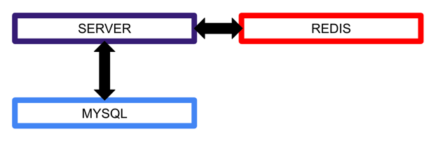

# queueroup

Queue + Group Open Project - User Line Up Grouping Service

Queueroup is a service that groups users in chronological order.
Grouped by N people and get user group information for users in the group.
The service is designed to help you line up and group distributed users for those who need it.
The idea of grouping was conceived from the pagination, which is often found on websites
Use the entire user group as Book, the small group as Chapter, and the user as Paper.
We have added a detailed description of grouping below.

Queueroup은 사용자들을 시간순으로 줄 세우고 일정 단위로 그룹화하는 서비스입니다.
N명 단위로 그룹화하며 그룹에 속한 사용자의 사용자 그룹 정보를 얻을 수 있습니다.
해당 서비스는 분산된 사용자에 대한 줄 세우기 및 그룹화가 필요한 대상에게 유용하게 사용되도록 하기 위해 제작하고 있습니다.
그룹화에 대한 아이디어는 흔히 웹사이트에서 볼 수 있는 pagination 에서 착안하였으며
전체 사용자 그룹을 Book, 소그룹은 Chapter, 사용자는 Paper 로 명명하여 사용합니다.
아래에는 그룹화에 대한 자세한 설명을 추가하였습니다.

## Grouping Function Description

We line up users in chronological order and create groups of N people in real time.
사용자를 시간 순으로 줄세우고 N 명 단위로 그룹을 생성합니다.

We use MySQL and Redis to store PAGE in chronological order.  
PAGE 를 시간 순으로 저장하기 위해 MySQL 과 Redis 를 사용합니다.

## How to read/write Redis